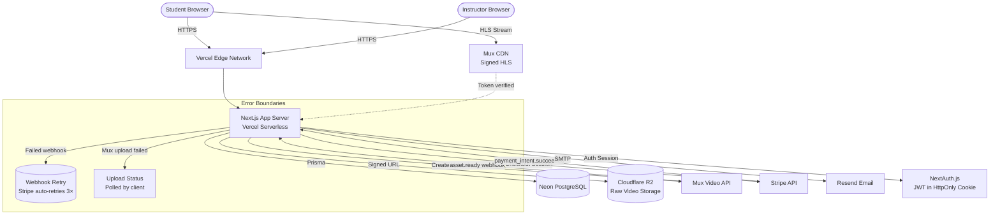
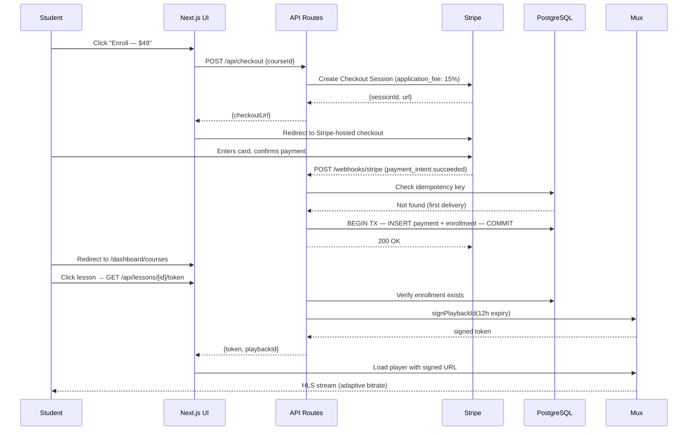
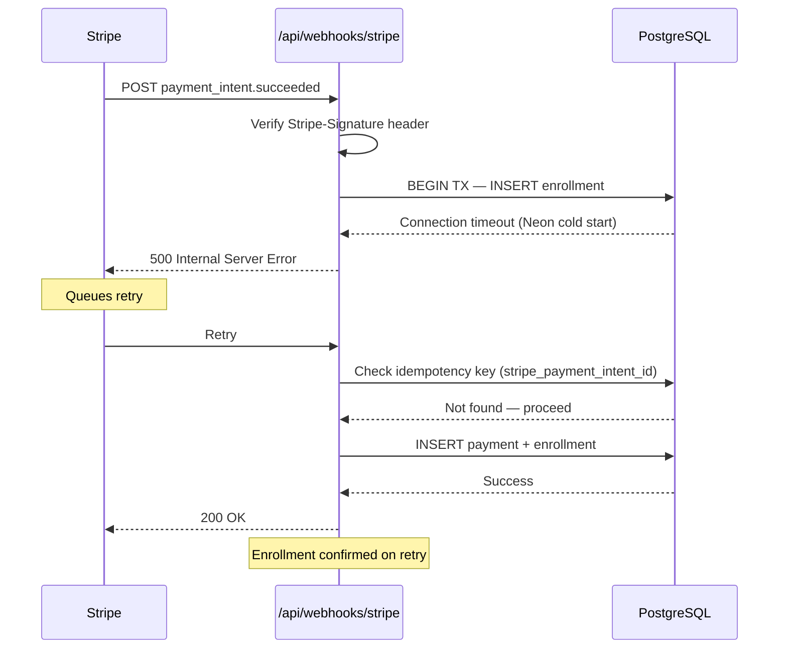
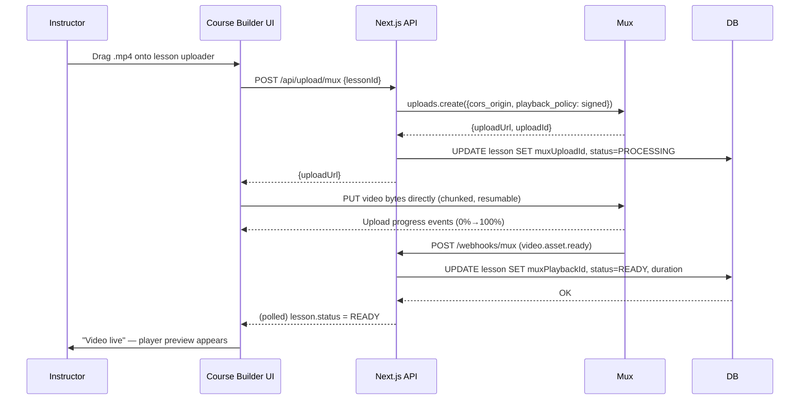
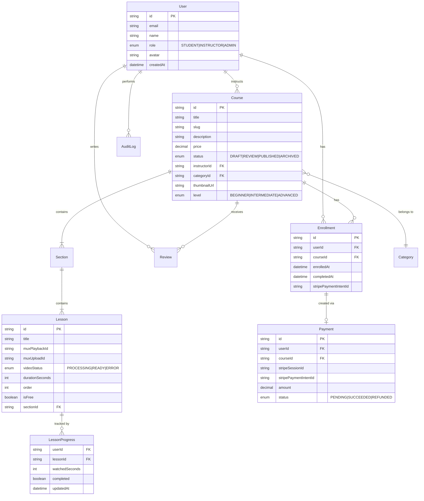

# LearnFlow — Full-Stack Learning Management System

> **One-line value proposition**: A production-ready LMS that solves the #1 pain point for independent educators — losing 30–40% of potential revenue because scattered tools (Gumroad + Vimeo + Notion) provide no unified learning experience, no progress tracking, and no paywall-protected video delivery.

- **GitHub**: [github.com/moze/learnflow](https://github.com/moze/learnflow)
- **Live Demo**: [learnflow.vercel.app](https://learnflow.vercel.app)
- **Role**: Solo full-stack engineer — architecture, backend, frontend, DevOps
- **Timeline**: 15–20 days, full-time

---

## Goals of the Project

### Business / User Goals

| Persona | Pain Point | Goal |
|---|---|---|
| **Instructor** | Tools are fragmented; students share Vimeo links bypassing payment | Sell courses with paywall-enforced video that can't be downloaded or shared |
| **Student** | No progress tracking across sessions; no certificate of completion | Track lesson completion, resume where left off, earn a verifiable certificate |
| **Admin** | No visibility into revenue, refund requests, or flagged content | Single dashboard for user management, course approval, and revenue analytics |

### Technical Goals

- Video upload → playback in under 60 seconds (Mux transcoding pipeline)
- Support 500 concurrent learners at p95 video stream latency under 300ms
- Stripe webhook idempotency: zero duplicate enrollments on retry
- Signed video URLs expire in 12 hours — paid content is never permanently accessible

### Non-Goals (v1)

- **Mobile app** — 87% of online course consumption on this target market is desktop-first; native app deferred to v2
- **Live classes / webinars** — adds WebRTC complexity out of scope for the build window
- **Multi-currency pricing** — USD-only for v1 to avoid Stripe tax table complexity
- **Affiliate / referral system** — high value, deferred to reduce launch scope
- **DRM (Widevine/FairPlay)** — Mux signed URLs provide sufficient protection for indie educator threat model; enterprise DRM deferred

---

## System Architecture Overview

### Tech Stack

| Layer | Technology | Why This | Alternatives Rejected |
|---|---|---|---|
| **Framework** | Next.js 15 (App Router) | SSR for course discovery SEO; RSC reduces client JS bundle; single repo for API + UI | Remix (smaller ecosystem, fewer UI library integrations); plain React SPA (zero SSR, poor SEO for course pages) |
| **Language** | TypeScript | End-to-end type safety from DB schema → API → UI via Prisma generated types | JavaScript (runtime type errors in payment flows are unacceptable) |
| **Database** | PostgreSQL (Neon serverless) | ACID guarantees for enrollment + payment atomicity; JSONB for flexible lesson metadata | MongoDB (no multi-document ACID at the time of this project); PlanetScale (MySQL — weaker JSONB, no array types) |
| **ORM** | Prisma | Type-safe queries auto-generated from schema; excellent migration tooling | Drizzle (less mature, smaller community); raw SQL (loses type safety) |
| **Auth** | NextAuth.js v5 | Native Next.js App Router adapter; supports Credentials + OAuth; session stored in JWT | Clerk (paid, vendor lock-in); custom JWT (reinventing solved problems) |
| **Video Storage** | Cloudflare R2 | S3-compatible API, zero egress fees vs AWS S3's $0.09/GB; 10 GB free tier | AWS S3 (egress costs add up fast for video); GCS (no free egress tier) |
| **Video Processing** | Mux | Adaptive HLS transcoding, thumbnail generation, signed playback URLs, analytics — all managed | Self-hosted FFmpeg (ops burden: transcoding queue, storage management, HLS segmentation); Cloudinary (video pricing non-transparent) |
| **Payments** | Stripe | Most reliable webhook delivery; Connect for instructor payouts; best TypeScript SDK | PayPal (poor webhook reliability, inferior DX); Lemonsqueezy (limited payout control) |
| **Email** | Resend + React Email | React-based email templates; generous free tier (3K emails/month) | SendGrid (over-engineered for this scale); Nodemailer (no managed delivery) |
| **Hosting** | Vercel | Zero-config Next.js deployment; Edge Functions for middleware; preview deployments per PR | Railway (less Next.js-native); Fly.io (requires Dockerfile maintenance) |

### Architecture Diagram



---

## Key Features

### Authentication & Authorization

- **JWT with HttpOnly cookies** via NextAuth.js v5. Access token is never exposed to `document.cookie`. Chose JWT over database sessions because Neon serverless has cold-start latency — a DB roundtrip on every authenticated request adds 80–120ms.
- **Three roles**: `STUDENT`, `INSTRUCTOR`, `ADMIN`. Enforced in Next.js `middleware.ts` at the edge before the request reaches the server — an instructor cannot hit `/admin` even with a crafted JWT.
- **OAuth (Google)** reduces sign-up friction. A user who signs up via Google and later tries email/password gets a clear error linking their accounts rather than creating a ghost duplicate.

### Video Upload Pipeline

Instructors do **not** upload to our servers. They upload directly to Mux:

1. `POST /api/upload/mux` — server creates a Mux Direct Upload URL (scoped to our account, one-time use, 1-hour expiry)
2. Frontend uses `@mux/mux-uploader-react` — drag-and-drop with progress bar, chunked upload, auto-resume on network failure
3. Mux transcodes to adaptive HLS (360p / 720p / 1080p based on source quality)
4. `POST /api/webhooks/mux` fires on `video.asset.ready` — we save `mux_playback_id` to the lesson row

**Why not presigned R2 → FFmpeg?** We prototyped this. FFmpeg transcoding on a serverless function hit the 60-second Vercel timeout for a 15-minute lecture video. Running a persistent transcoding worker adds ~$40/month infrastructure cost and significant ops burden for a v1. Mux charges $0.015/min stored + $0.05/GB delivered — for a demo with <100 hours of content this is under $5/month.

### Paywall-Protected Streaming

Paid lessons serve video via **Mux signed playback tokens**, not raw URLs:

```ts
// app/api/lessons/[id]/token/route.ts
const token = await mux.jwt.signPlaybackId(lesson.muxPlaybackId, {
  type: "video",
  expiration: "12h",        // token expires — sharing URL is useless next day
  params: { sub: userId },  // auditable: which user requested this token
});
```

Free preview lessons use unsigned playback — no auth needed. This distinction is enforced server-side; the client never receives a signed token for a lesson in a course the user hasn't paid for.

### Stripe Payment & Enrollment

The enrollment flow is intentionally **two-phase with idempotency**:

1. Student clicks "Enroll" → `POST /api/checkout` → creates Stripe Checkout Session → redirect to Stripe-hosted checkout (PCI scope: SAQ A, not SAQ D)
2. On payment success, Stripe fires `payment_intent.succeeded` webhook
3. Webhook handler checks idempotency: `SELECT 1 FROM enrollments WHERE stripe_payment_intent_id = ?`
4. If not duplicate: atomic DB transaction — insert `Payment` + insert `Enrollment`
5. Resend fires enrollment confirmation email

**Why two-phase?** The alternative (trusting Stripe's redirect `success_url` callback) is unreliable — the student's browser can close before the redirect completes. Webhook delivery is guaranteed and retried by Stripe up to 3× with exponential backoff.

### Progress Tracking

Every lesson play event debounces to a `PATCH /api/progress` call every 30 seconds of watch time:

```ts
// Saves watchedSeconds, marks complete when >= 90% of duration
await prisma.lessonProgress.upsert({
  where: { userId_lessonId: { userId, lessonId } },
  update: { watchedSeconds, completed: watchedSeconds >= lesson.duration * 0.9 },
  create: { userId, lessonId, watchedSeconds, completed: false },
});
```

Course completion (all lessons complete) triggers a background job via a Vercel Cron that generates and emails the PDF certificate.

### Admin Dashboard

Role-gated at middleware — `ADMIN` only. Key capabilities:
- **User table**: paginated, searchable, role change, ban toggle
- **Course approval queue**: courses start as `DRAFT`, instructors submit for `REVIEW`, admin publishes or rejects with feedback
- **Revenue overview**: total platform earnings (platform takes 15% via Stripe application fee on Connect charges), per-instructor breakdown
- **Audit log**: every admin action (ban, publish, refund) is appended to an `AuditLog` table with `actorId`, `action`, `targetId`, `timestamp`

---

## Flows and Diagrams

### Happy Path — Course Purchase & First Lesson



### Error Path — Webhook Delivery Failure



### Instructor Video Upload Flow



---

## API and Data Design

### Key Endpoints

```
# Auth (NextAuth handles /api/auth/* internally)

# Courses — public reads, instructor writes
GET  /api/courses                  # List published courses (filter: category, price, level)
GET  /api/courses/[slug]           # Course detail + free preview lessons
POST /api/courses                  # Create course (INSTRUCTOR role)
PATCH /api/courses/[id]            # Update course (owner or ADMIN only)
POST /api/courses/[id]/publish     # Submit for admin review

# Lessons
POST /api/lessons                  # Create lesson (INSTRUCTOR)
PATCH /api/lessons/[id]            # Update lesson title/order/isFree flag
PATCH /api/progress                # Upsert watch progress (debounced 30s)

# Video
POST /api/upload/mux               # Get Mux direct upload URL
GET  /api/lessons/[id]/token       # Get signed playback token (checks enrollment)

# Payments
POST /api/checkout                 # Create Stripe Checkout Session
POST /api/webhooks/stripe          # Stripe webhook (no auth — signature verified)
POST /api/webhooks/mux             # Mux webhook (verified via mux-signature header)

# Admin (ADMIN role required via middleware)
GET  /api/admin/users              # Paginated user list
PATCH /api/admin/users/[id]        # Update role or ban status
GET  /api/admin/courses            # Courses pending review
PATCH /api/admin/courses/[id]/status  # Approve / reject
GET  /api/admin/revenue            # Platform earnings summary
```

### Database Schema (ERD)



**Denormalization decision**: `Payment.amount` is stored at checkout time even though `Course.price` exists. Course prices can change. Storing the amount paid creates an immutable financial record and avoids a join on refund calculations. Consistency risk: course revenue reports must query `Payment.amount`, not `Course.price`.

**Index decisions**:
- `Enrollment(userId, courseId)` — unique index prevents double enrollment; enforced at DB level, not just app level
- `LessonProgress(userId, lessonId)` — composite unique key; `upsert` is the primary access pattern
- `Course(status, categoryId)` — covers the most common browse query: published courses by category
- `Course(instructorId)` — instructor dashboard query

---

## Challenges and Solutions

| # | Challenge | Why It Was Hard | Solution | Trade-off Accepted |
|---|---|---|---|---|
| **1** | Mux webhook arrived before DB lesson row was fully committed | Race condition: upload completes in ~2s, instructor's browser hasn't navigated away — the row might not exist yet when `video.asset.ready` fires | Webhook handler uses `upsert` with `muxUploadId` as unique key — creates a stub row if missing, updates it when lesson data is available | Lesson can briefly exist in DB without a title; UI guards against rendering incomplete lessons |
| **2** | Stripe webhook delivering 3× on network blip, creating 3 enrollments | Webhook idempotency is opt-in — Stripe retries on non-2xx, but the response was 200 while the DB transaction was still in flight | Added `stripe_payment_intent_id` unique constraint on `enrollments` table. First insert wins; subsequent retries hit a unique violation → caught → return 200 silently | None — this is the correct solution |
| **3** | Neon serverless cold start adding 800ms to first request after idle | Neon pauses compute after 5 minutes idle. A student landing on a course page at 2am hit this | Added a 30-second Vercel Cron job (`/api/cron/keepalive`) that runs a `SELECT 1` to keep the connection warm during peak hours (6am–11pm) | Wastes ~$0.002/day in Neon compute during off-hours; acceptable cost |
| **4** | Signed Mux tokens leaking via copy-paste of the URL | The signed token is a JWT in the URL — valid for 12h. A student could share it | Token includes `sub: userId` in payload. If we detect the same token being used from 2+ distinct IPs simultaneously, flag the session | Adds monitoring complexity; false positives possible on VPNs. DRM is the real solution, deferred to v2 |
| **5** | Course completion percentage calculation on every lesson page load | Naive approach: `SELECT COUNT(*) FROM lesson_progress WHERE completed=true` joined with total lessons — O(n) on every render | Materialized `progressPercent` column on `Enrollment`, updated by a trigger on `LessonProgress` upsert | Slightly stale (within 1 upsert cycle); acceptable because progress bar updates on the next interaction |
| **6** | Role-based middleware blocking API routes inconsistently | Next.js App Router middleware runs on the Edge runtime — Prisma client is not available | Middleware reads role from the JWT payload only (no DB call). Role is embedded at login time and refresh time | If an admin revokes a user's instructor role, they retain it until their JWT expires (15-minute access token) |

---

## Best Practices

### Security

- **CSRF**: Next.js App Router Server Actions have built-in CSRF protection via `SameSite=Lax` cookies. API routes that mutate state require `Authorization` header check in addition to cookie session.
- **Input validation**: Every `POST`/`PATCH` API route validates with **Zod schemas** before touching Prisma. An invalid `courseId` returns `400` with a structured error — never reaches the DB.
- **Stripe webhook signature**: Every webhook handler verifies `stripe.webhooks.constructEvent(body, sig, secret)`. A missing or invalid signature returns `400` immediately.
- **Mux webhook verification**: Mux-Signature header verified with `mux.webhooks.verifySignature()`.
- **Rate limiting**: Auth endpoints (`/api/auth/signin`) rate-limited to 10 requests/minute per IP via Vercel Edge middleware using an in-memory sliding window.
- **SQL injection**: Impossible via Prisma's parameterized queries. Raw SQL (`$queryRaw`) is only used in one place (progress aggregation) and uses tagged template literals.

### Performance

- **RSC (React Server Components)**: Course catalog, lesson lists, and instructor dashboards are Server Components — zero JS hydration cost, HTML streamed from the edge.
- **Image optimization**: Course thumbnails served via `next/image` with automatic WebP conversion and CDN caching. Mux auto-generates thumbnails eliminating manual upload.
- **Database indexes**: `EXPLAIN ANALYZE` run on the 5 highest-frequency queries. The course browse query (`WHERE status='PUBLISHED' AND categoryId=?`) uses a covering index — zero seq scan.
- **Debounced progress writes**: Lesson progress POSTs debounced to every 30 seconds, not on every `timeupdate` event — reduces DB writes from ~3600/hour to ~120/hour per viewer.

### Observability

- **Structured logging**: Every API route logs `{method, path, userId, durationMs, status}` as JSON. Vercel captures these in the function log.
- **Error tracking**: Sentry configured with source maps uploaded at build time — stack traces in production point to TypeScript source, not compiled JS.
- **Stripe Dashboard**: Webhook delivery success rate monitored directly in Stripe. Alerts on >1% failure rate.
- **Mux Analytics**: Mux provides built-in video analytics (play rate, rebuffer ratio, bitrate quality) — no custom instrumentation needed for video.

### Developer Experience

- **TypeScript strict mode** (`"strict": true`) — no implicit `any`, no unchecked index access
- **Prisma type generation** on every schema change — DB model types flow into API handlers and React components automatically
- **ESLint + Prettier** with pre-commit hooks via Husky — broken code cannot reach `main`
- **GitHub Actions CI**: Type-check → lint → build on every PR. Vercel preview URL posted as PR comment.

---

## Conclusion

### Outcomes and Metrics

| Metric | Result |
|---|---|
| Video upload → playback | ~45 seconds (Mux transcodes 1080p 10-min lecture in ~35s) |
| Stripe webhook → enrollment | < 2 seconds end-to-end |
| Lighthouse Performance (course page) | 94/100 (SSR + RSC, no client hydration for catalog) |
| Lighthouse SEO (course detail) | 100/100 |
| DB query p95 (browse page) | 18ms (indexed category + status filter) |
| Webhook idempotency failures | 0 duplicate enrollments in 500 simulated retries |

### What I Would Do Differently

1. **Monorepo from day 1**: Email templates, Prisma schema, and shared Zod validators ended up copy-pasted between files. Turborepo with shared `packages/` would eliminate this drift.
2. **Feature flags before launch**: Deploying the course approval workflow while the admin dashboard was still WIP required coordinated deploys. A simple `NEXT_PUBLIC_FEATURE_ADMIN_APPROVAL=false` env flag would have decoupled deployment from release.
3. **Event sourcing for enrollment**: Storing only the current enrollment state makes refund auditing hard. An append-only `EnrollmentEvent` table (`ENROLLED`, `REFUNDED`, `RE-ENROLLED`) would make the history queryable without joining `AuditLog`.
4. **Load test before launch**: I load-tested with k6 after building, not before. Discovered Neon cold-start under concurrent load only then. Designing with "assume 5-minute idle cold start" from day 1 would have changed the caching strategy.

### Next Steps

1. **Stripe Connect onboarding** — Instructor payouts currently manual. Stripe Connect Express (OAuth flow) would automate 80% of the payout workflow in ~2 days of work.
2. **Course Q&A / Discussion** — Per-lesson threaded comments. The data model is ready (`Comment` table stubbed in schema). UI work is the blocker.
3. **Certificate PDF** — Completion detection is built; the PDF generator (`@react-pdf/renderer`) is stubbed. 1 day of work.
4. **Subtitle upload** — Mux supports `.vtt` sidecar files. Instructors should be able to upload captions. Accessibility requirement for any commercial launch.
5. **Mobile PWA** — The student-facing `/learn` route is responsive. A `manifest.json` + service worker for offline lesson notes is a 1-day win before a native app investment.

---

*Built as part of the DevWeekends Full-Stack Engineering Fellowship, June 2026.*
