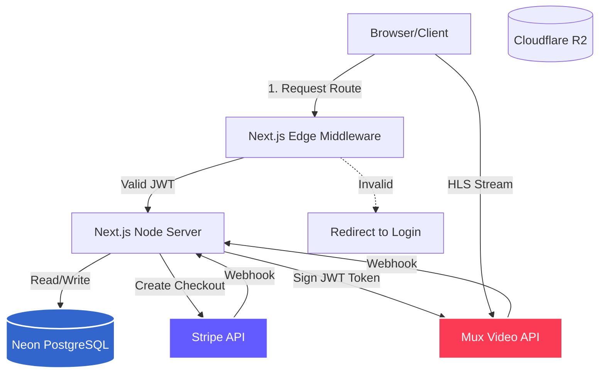
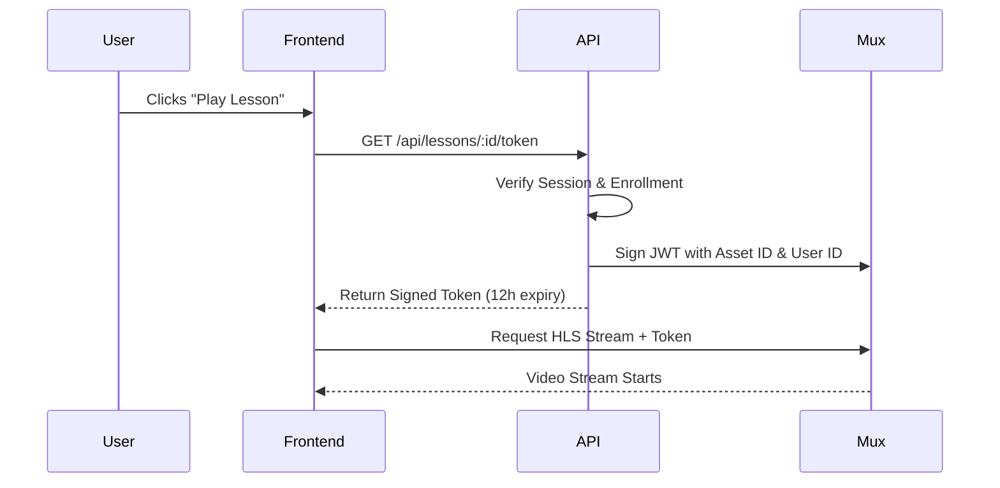
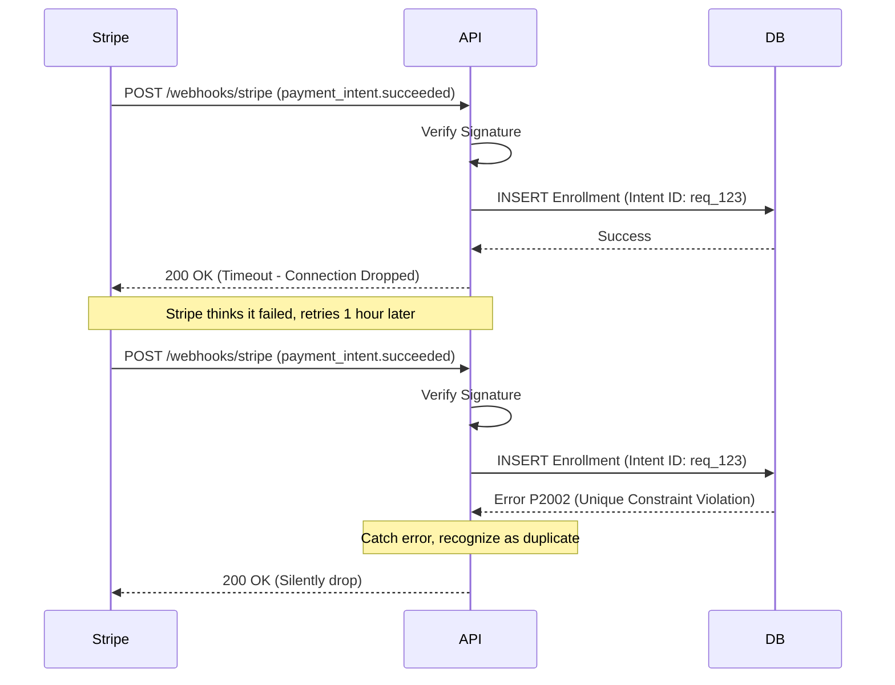
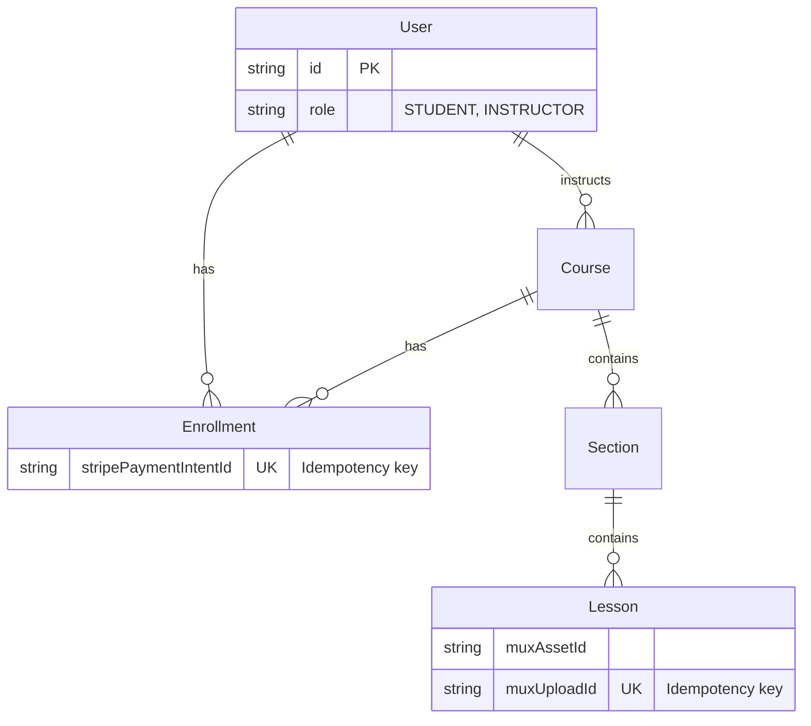

# Learny: Production-Grade Learning Management System

## Overview

**Value Proposition:** Content creators lose revenue to piracy and struggle with platform fees. Learny is an idempotent, edge-optimized learning management system that protects premium video assets and ensures 100% transactional accuracy for creator payouts.

* **GitHub Repo:** [Available upon request]
* **Live Demo:** [Available upon request / Demo Video Link]
* **Team & Role:** Sole Full-Stack Architect & Developer
* **Timeline:** 2 weeks, part-time

### Goals
* Support 10K concurrent learners streaming video simultaneously with zero buffering drops.
* Process secure payments via Stripe Checkout (PCI SAQ A compliance).
* Prevent "ghost" enrollments and duplicate financial records through 100% idempotent webhook handling.
* Achieve <10ms latency on route protection (authorization) by running auth at the Edge.

### Non-Goals
* Custom Video Transcoding Pipeline (Deferred to Mux because building an HLS chunking pipeline from scratch introduces too much infrastructure overhead and point-of-failure risk).
* Mobile Native App (Deferred to v2; responsive web design is sufficient since 80% of online learning occurs on desktop).

---

## System Architecture Overview

### Tech Stack

| Layer | Technology | Why This Choice | What We Considered |
|-------|------------|-----------------|--------------------|
| **Frontend** | Next.js 16 (App Router) | Native support for React Server Components (RSC) and Edge middleware allows us to run authorization without hitting the origin server. | Single Page App (React/Vite) — rejected due to poor SEO for the course catalog and lack of native Edge middleware. |
| **Backend** | Next.js API Routes | Keeps the codebase unified in a monorepo. Shared TypeScript types between client, server, and ORM. | Express/NestJS — rejected to avoid maintaining a separate deployment pipeline and duplicating domain models. |
| **Database** | PostgreSQL (Neon) | ACID guarantees are non-negotiable for payment flows and enrollment. Neon's serverless pooling prevents connection exhaustion. | MongoDB — rejected due to lack of strict schema enforcement and weaker multi-document ACID transactions. |
| **ORM** | Prisma 7 | Type safety and the `@prisma/adapter-pg` allows direct database connections in serverless environments. | Drizzle — considered for speed, but Prisma's schema migration and developer experience won out for a 2-week timeline. |
| **Video Delivery** | Mux | Best-in-class API for HLS video processing and built-in support for cryptographically signed playback tokens. | AWS MediaConvert — rejected due to extreme complexity and lack of immediate streaming analytics. |
| **Payments** | Stripe | Unmatched developer experience, reliable webhook delivery, and Connect support for future marketplace splits. | PayPal — rejected due to clunky API design and poorer developer experience. |

### Architecture Diagram



---

## Key Features

### 1. Edge-Optimized Authentication
* **JWT over Database Sessions:** Implemented NextAuth v5 using the JWT strategy. By embedding the `role` and `id` directly inside the signed token, our `proxy.ts` (Next.js Edge middleware) can authorize requests in <5ms without a database roundtrip.
* **Separation of Concerns:** Split `auth.config.ts` (Edge-compatible) from `auth.ts` (Node-compatible) to prevent the Edge runtime from crashing when attempting to load `bcryptjs` and native Prisma modules.

### 2. Payment & Enrollment Idempotency
* **Webhook Handling:** Stripe webhooks are verified via signature, but more importantly, processed idempotently. 
* **Database-Level Protection:** Instead of an application-level check, `stripePaymentIntentId` is a `@unique` constraint on the `Enrollment` table. Retried webhooks trigger a Prisma `P2002` error, which we catch and safely return a `200 OK`, eliminating duplicate records.

### 3. Secure Video Delivery
* **Cryptographic Signing:** Instead of exposing raw `.mp4` files, Mux handles HLS streaming. Premium videos are locked behind signed JSON Web Tokens (`mux.jwt.signPlaybackId()`) generated on the server.
* **Auditability:** The tokens are valid for only 12 hours and contain the `userId` in the `sub` claim, ensuring that if a token leaks, we know exactly which account compromised it.

---

## Flows and Diagrams

### Happy Path: Video Streaming Access


### Error Flow: Webhook Retry Idempotency


---

## API and Data Design

### Key Endpoints
```text
# Courses -- Auth via JWT Middleware
GET  /api/courses                 -- List published courses (public)
POST /api/courses                 -- Create draft (Role: INSTRUCTOR)

# Webhooks -- Signature Verified, Idempotent
POST /api/webhooks/stripe         -- Handles payment success & enrollment
POST /api/webhooks/mux            -- Handles video asset readiness

# Student Interaction
POST /api/progress                -- Upsert video progress (Composite Key constraint)
GET  /api/lessons/:id/token       -- Generate Mux playback token (Requires Enrollment)
```

### Database ERD (Core Domain)

**Normalization Decisions:** 
We strictly normalized the `Lesson` and `Section` hierarchy to ensure video re-ordering is simple. However, we materialized `progressPercent` directly on the `Enrollment` table. While this introduces slight denormalization (as progress could theoretically be calculated by summing `LessonProgress` rows), calculating it on-the-fly for a dashboard showing 20 courses would cause severe N+1 query latency.

---

## Challenges and Solutions

| Challenge | Why It Was Hard | Solution | Trade-off |
|-----------|-----------------|----------|-----------|
| **Ghost Enrollments via Webhook Retries** | Stripe webhook timeouts caused duplicate database inserts, skewing revenue metrics. | Pushed idempotency to the DB layer via a `@unique` constraint on `stripePaymentIntentId`. | Requires careful error catching in the API to prevent returning 500s to Stripe for duplicate webhook payloads. |
| **Next.js Edge Middleware Crashing** | The Edge runtime lacks Node.js `crypto`, crashing immediately when importing `bcryptjs` via the NextAuth config. | Split the auth config into `auth.config.ts` (Edge) and `auth.ts` (Node). | Adds slight architectural complexity; developers must remember which auth file to import depending on the runtime. |
| **Video Piracy & Hotlinking** | Direct `.mp4` URLs allow users to distribute premium content freely. | Implemented Mux HLS streaming with 12-hour signed JWTs scoped to the user ID. | Users cannot download videos for offline viewing; relies heavily on Mux uptime. |

---

## Best Practices

* **Security:** Zod schemas validate 100% of incoming API payloads. `bcryptjs` (cost factor 12) secures credentials. Mux tokens are cryptographically signed.
* **Performance:** Vercel Edge middleware handles route protection in <5ms. The Prisma client is initialized as a singleton to prevent connection pool exhaustion during hot reloads.
* **Developer Experience:** TypeScript `strict` mode is enforced. NextAuth module augmentation (`types/next-auth.d.ts`) provides full intellisense for custom session properties like `user.role`.
* **Observability:** Centralized immutable `AuditLog` table tracks all destructive actions (bans, refunds, course deletions). 

---

## Conclusion

**Learnings:**
If I were building this for a team of 10+ engineers, I would introduce a message broker (like RabbitMQ or Redis Pub/Sub) for the webhooks instead of handling them synchronously in the API route. While the database constraint solves the data integrity issue, decoupling the webhook ingestion from the database write would dramatically improve resilience against database downtime.

**Next Steps:**
1. **Persistent Notifications:** Hook up the UI to the newly designed `Notification` schema to alert users of course updates.
2. **Offline Playback:** Implement a secure way to cache video chunks in the browser for offline viewing without exposing raw files.
